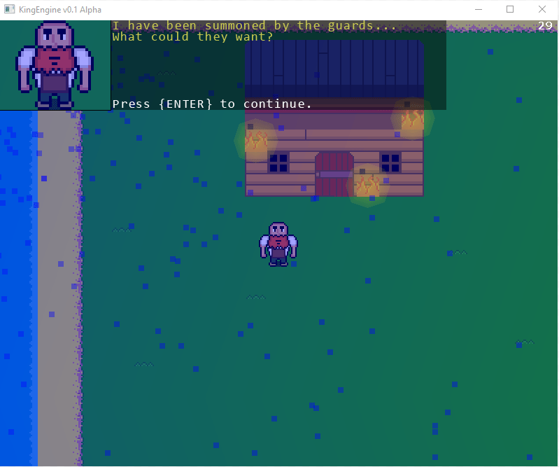
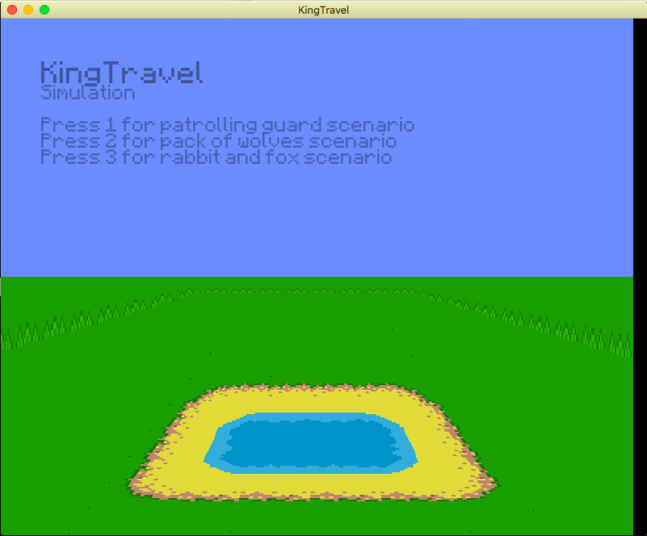
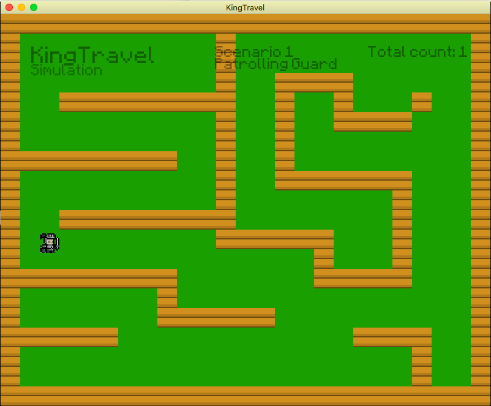
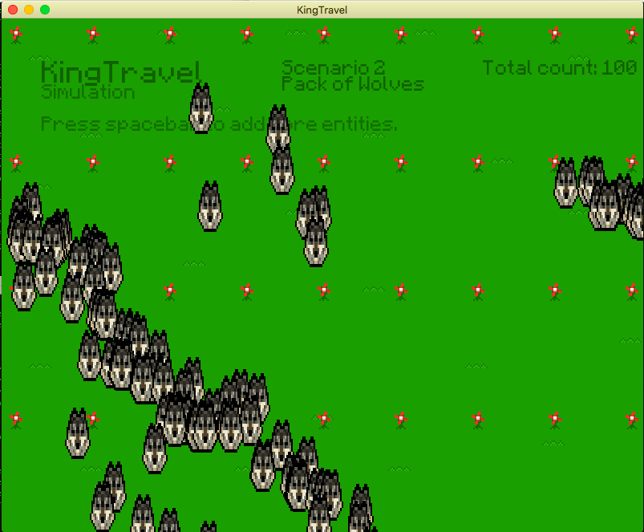
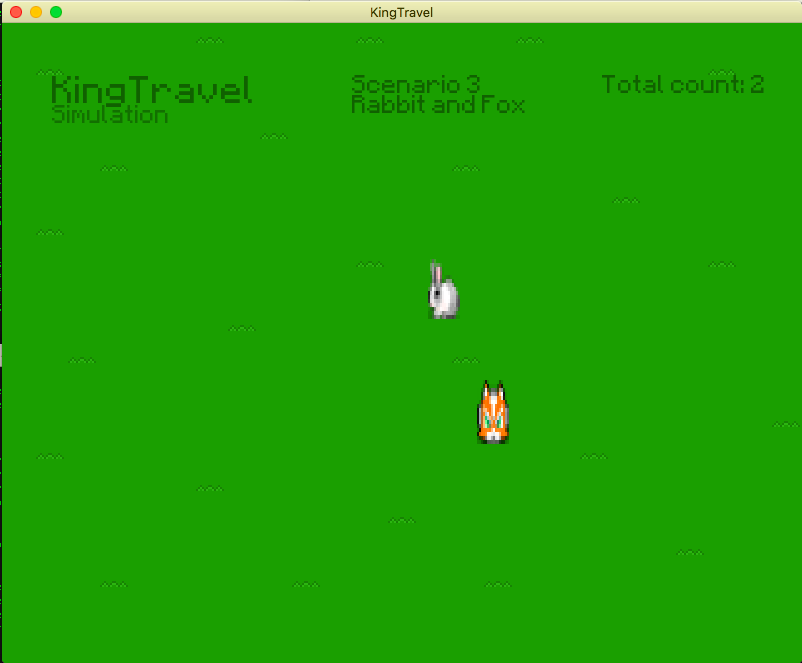

 

###<b>Description:</b> 
---
A 2D and limited 3D perspective game engine created with C++ / SFML and scripted game content through Lua. This project
includes the KingTravel AI movement library which is an implementation of the A* pathfinding algorithm, and
Craig Reynold's Flocking algorithm to simulate group and individual steering behaviors for Non-Playable Characters (NPCs) to have realistic, and autonomous or self governing movement.

The 3D perspective is still experimental and limited in camera angle, though the KingTravel demo contains an opening splash screen in the 3D view.

###<b>Technologies:</b> 
---
C++, SFML and the Lua scripting language.  

###<b>Screenshots:</b> 
---
####Demonstration of the particle engine, lighting system and map generation. 
 

####Opening 3D perspective splash screen for the KingTravel Demo. 
 

####Demonstration of A* pathfinding algorithm. 
 
In this shot the guard is navigating the puzzle on his own using this algorithm. 

####Demonstration of Flocking algorithm for group steering behaviors. 
 
Every wolf in this large pack is actively trying to stay separated from one another,
aligned with one another, while still staying cohesive with the larger group as they chase after my cursor. 

####Demonstration of individual steering behaviors for autonomous movement. 
 
The fox is actively pursuing the future position of the rabbit, while the rabbit evades the future position of the fox. 

###<b>Installation:</b> 
---
<i>Note: SFML is available under the lib folder of this project. You may need to pull a new version from: https://github.com/SFML/SFML</i>  
1. Modify Makefile by changing the SFML flag to link to your local SFML/lib folder.  
2. Change the CXX flag of the Makefile to match a compiler you have installed. (If you don't use g++)  
3. Navigate to the src folder and run "make".  
4. Run <i>KingEngine</i> executable. 

###<b>Inspiration:</b> 
---
For years I've wanted to program my own 2D game engine with a complete top-down view, particle engine, battle system, AI, UI menu system, and more. It's only over time that I've finally grown enough to make this possible. This project is and always will be fueled by my passion for stretching myself to learn new programming techniques, graphical optimizations, and above all using creativity to drive these advances. I hope that as I continue to improve and optimize this engine which has now grown from a solely 2D engine, to include a new 3D perspective, that others may also be inspired in their own endeavors.

###<b>Contribution Guidelines:</b> 
---
Currently you can contact me at jacob.neal@oit.edu for suggestions on future changes or additions you'd like to
see in the engine. This is currently my own individual project, but if you'd like to be added as a contributor just reach out to me. 

<i>Feedback is always welcome.</i> 

###<b>License:</b> 
---
The MIT License (MIT) 
Copyright (c) 2016 Beyond Parallel 

Permission is hereby granted, free of charge, to any person obtaining a copy of this software and associated documentation files (the "Software"), to deal in the Software without restriction, including without limitation the rights to use, copy, modify, merge, publish, distribute, sublicense, and/or sell copies of the Software, and to permit persons to whom the Software is furnished to do so, subject to the following conditions: 

The above copyright notice and this permission notice shall be included in all copies or substantial portions of the Software. 

THE SOFTWARE IS PROVIDED "AS IS", WITHOUT WARRANTY OF ANY KIND, EXPRESS OR IMPLIED, INCLUDING BUT NOT LIMITED TO THE WARRANTIES OF MERCHANTABILITY, FITNESS FOR A PARTICULAR PURPOSE AND NONINFRINGEMENT. IN NO EVENT SHALL THE AUTHORS OR COPYRIGHT HOLDERS BE LIABLE FOR ANY CLAIM, DAMAGES OR OTHER LIABILITY, WHETHER IN AN ACTION OF CONTRACT, TORT OR OTHERWISE, ARISING FROM, OUT OF OR IN CONNECTION WITH THE SOFTWARE OR THE USE OR OTHER DEALINGS IN THE SOFTWARE. 
